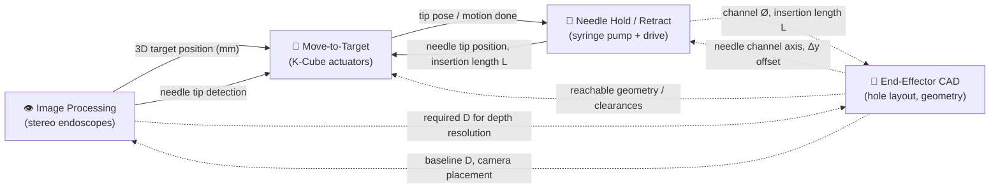
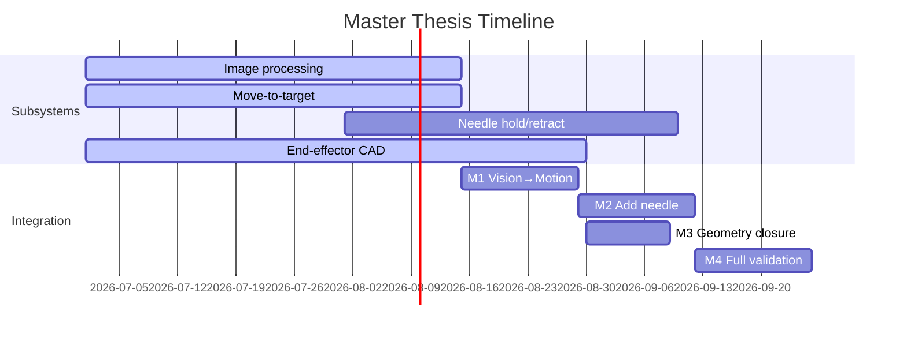

# Project Overview — Dual-Endoscope + Needle-Injection End-Effector

**Purpose of this file:** single source of truth for *what to work on next* and *how the pieces fit together*, so no subsystem gets built twice.

> **How to use this doc**
> - Open it → read **Next Up** → that's what to work on.
> - "Next Up" is derived from the subsystem **Status** + **Waiting on** fields below. When a subsystem's dependency is satisfied (see the Interface Table), it becomes unblocked and moves up.
> - Before building anything, check the **Interface Table**: if another subsystem already *produces* what you need, consume it — don't rebuild it.
> - When you make a design choice, add a dated line to the **Decision Log**. Future-you writing the thesis discussion will need it.

Status legend: 🔲 Not started · 🟡 In progress · ⛔ Blocked · ✅ Done

---

## ⏭️ Next Up (read this first)

*Keep this to 3–5 concrete actions. Pull them from whatever is 🟡 In progress or newly unblocked.*

1. 🟡 **Endoscope assembly — controller housing.** Endoscopes (muC112) ordered; design & build a proper enclosure for their controller boards. → *Image Processing / hardware build.*
2. …
3. …

_Last reviewed: 2026-07-06_

---

## 🗺️ System Architecture

The four subsystems and what flows between them. The **end-effector CAD is where they physically meet** — it consumes constraints from all three functional subsystems.

*Solid arrows = runtime data flow. Dashed arrows = design-time constraints (mostly into/out of the CAD).*

---

## 📦 Subsystems

### 👁️ Image Processing (stereo endoscopes)
- **Status:** 🟡 In progress
- **Goal:** turn the two muC112 camera feeds into a 3D target position (and detect the needle tip) with adequate depth resolution.
- **Produces:** 3D target position (mm), needle-tip detection, required baseline `D` for a given depth tolerance.
- **Consumes:** camera images; camera placement / baseline `D` from CAD.
- **Existing work in repo:**
  - `docs/stereo_endoscope_baseline_report.md` — depth-resolution theory (ΔZ = Z²·Δd/(f·D)).
  - `analysis_scripts/multiobjective_sweep.py` — depth / FOV / reconstructability vs `D`.
  - `aprilgrid_blender/` — calibration & resolution-vs-distance analysis (rendered AprilGrid dataset).
  - `Motordriver/apriltag_tracker.py`, `needle_detector.py` — live tag / needle detection.
- **Waiting on:** —
- **Hardware build:**
  - 🟡 muC112 endoscopes ordered. **Controller housing** — design & build a proper enclosure for the camera controller boards. *(current focus)*
- **Open items:** real (not simulated) stereo calibration of the two muC112 cameras; convert 2D detections → 3D target in a shared coordinate frame.

### 🎯 Move-to-Target (K-Cube actuators)
- **Status:** 🟡 In progress
- **Goal:** drive the Thorlabs stages so the needle tip reaches a target coordinate coming from vision.
- **Produces:** motion commands, current tip pose, "target reached" signal.
- **Consumes:** 3D target from vision; current needle-tip position from the needle system / vision.
- **Existing work in repo:**
  - `Motordriver/kcube_control.py`, `kcube_motion.py`, `kcube_raw_ethernet.py` — K-Cube (KDC101) drive.
  - `Motordriver/center_tag.py`, `needle_to_dot.py` — closed-loop "move needle to detected point".
  - `Motordriver/kcube_wasd_jog.py`, `kcube_wasd_needle_control.py` — manual jog control.
  - `Motordriver/kcube_axes.json` — axis mapping.
- **Waiting on:** stable 3D target output from Image Processing (currently works against a 2D detected dot).
- **Open items:** define the coordinate transform vision-frame → stage-frame (calibration); handle the 3rd (depth) axis.

### 💉 Needle Hold / Retract
- **Status:** 🔲 Not started (hardware selected)
- **Goal:** hold, insert, and retract the injection needle; drive the NE-300 syringe pump to deliver 100–500 µm vasculatures.
- **Produces:** needle tip position, insertion length `L`, injection actuation.
- **Consumes:** target-reached signal from Move-to-Target; channel geometry (Δy, channel Ø) from CAD.
- **Existing work in repo:** `Motordriver/kcube_wasd_needle_control.py` (partial — manual needle drive). Syringe pump NE-300 selected; no pump-control code yet.
- **Waiting on:** CAD to fix needle-channel axis and insertion-length envelope.
- **Open items:** NE-300 control interface; retraction mechanism design; couple insertion length `L` to the optimizer.

### 🧩 End-Effector CAD (integrating artifact)
- **Status:** 🟡 In progress
- **Goal:** physical Ø8 mm shell holding working channel + 2 endoscopes + syringe channel with maximum wall thickness; the geometry every other subsystem depends on.
- **Produces:** baseline `D`, camera placement, needle-channel axis + Δy offset, clearances, printable/machinable CAD.
- **Consumes:** required `D` from vision, needle channel Ø & `L` from needle system, reach constraints from motion.
- **Existing work in repo:**
  - `analysis_scripts/end_effector_layout.py` — optimizer (`optimize_layout`, `reposition_syringe`, `min_clearance`).
  - `analysis_scripts/layout_grid_sweep.py` → `figures/layout_grid_D_sweep.png`.
- **Waiting on:** —
- **Open items:** export the optimized layout to actual CAD files; make Δy a first-class optimization variable; feed final `D` back to vision.

---

## 🔗 Interface Table (the "don't do double work" tracker)

Each row is a hand-off between subsystems. If you're about to build something, check whether it already appears in a **Produces** cell here.

| Interface | Producer | Consumer | Format / units | Status |
|---|---|---|---|---|
| 3D target position | Image Processing | Move-to-Target | (x,y,z) mm in vision frame | 🔲 defining |
| Needle-tip detection | Image Processing | Move-to-Target | 2D px → 3D mm | 🟡 2D done |
| Vision→stage transform | (calibration) | Move-to-Target | 4×4 pose | 🔲 not started |
| Tip pose / "reached" | Move-to-Target | Needle Hold/Retract | flag + pose | 🔲 not started |
| Insertion length `L` | Needle Hold/Retract | Move-to-Target / CAD | mm | 🔲 not started |
| Baseline `D` | CAD | Image Processing | mm | 🟡 swept |
| Needle-channel axis + Δy | CAD | Needle Hold/Retract | mm | 🟡 optimizer |
| Required `D` for ΔZ tol | Image Processing | CAD | mm | 🟡 modelled |

---

## 🪜 Integration Milestones (staged bring-up)

Don't integrate all four at once — combine in stages so mismatches surface early.

- [ ] **M1 — Vision → Motion loop:** stage moves to a 3D point output by the stereo system (extends existing `needle_to_dot.py` from 2D to real 3D + calibrated transform).
- [ ] **M2 — Add needle actuation:** once at target, needle inserts/retracts and pump delivers.
- [ ] **M3 — Geometry closure:** final CAD `D`/Δy fed back into vision & needle; confirm depth resolution and clearances still hold.
- [ ] **M4 — Full-system validation:** end-to-end target → reach → inject on the bench.

---

## ❓ Open Design Questions
*(from CLAUDE.md / supervisor)*

- [ ] Needle-axis offset **Δy** from the stereo midline → make it a first-class optimization variable, not emergent.
- [ ] Syringe **insertion length `L`** → enter it into the multi-objective optimization (maximize reach where tip is in focus, in both frustums, ΔZ under tolerance).
- [ ] Working-channel Ø vs needle for 100–500 µm vasculatures — confirm ≈ Ø 0.8–1.0 mm holds.

---

## 🗒️ Decision Log
*Dated entries: what you chose and why. Append-only.*

| Date | Decision | Why |
|---|---|---|
| 2026-05-18 | Use `D` (center-to-center) instead of "baseline" in code/labels | User-renamed convention |
| — | … | … |

---

## 📅 Timeline (optional)
*Fill in real dates and swap this stub for your milestones. Renders as a Gantt on GitHub.*

